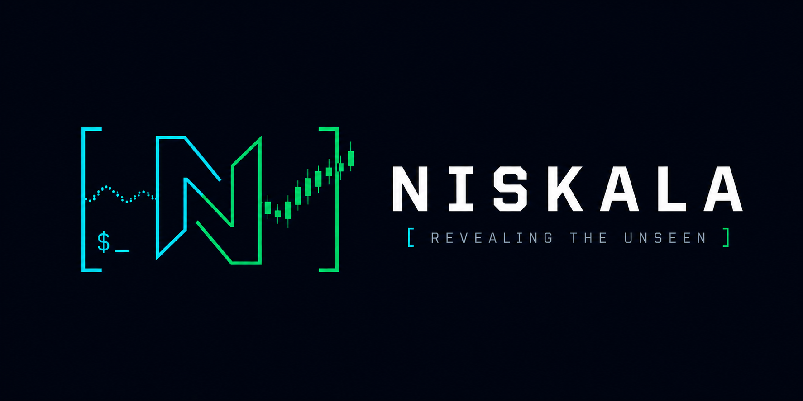

# Niskala - Changelog

All notable changes to Niskala will be documented in this file.

---

## [1.0.0] - 2026-07-06

### Phase 7: Global Expansion (NEW)

**Multi-Market Support:**
- ✅ MarketConfig abstraction layer
- ✅ 6 markets: IDX, SGX, Bursa, SET, PSE, HOSE
- ✅ Market registry for lookup/switching
- ✅ Configurable commission, lot size, tick size per market
- ✅ Trading hours with timezone support

**Multi-Language:**
- ✅ i18n translation engine
- ✅ 7 languages: English, Indonesian, Malay, Thai, Vietnamese, Filipino, Chinese
- ✅ User locale preferences
- ✅ 100+ translation keys per language

**Multi-Currency:**
- ✅ Exchange rate engine (Frankfurter API)
- ✅ Currency converter
- ✅ 10 currencies: IDR, SGD, MYR, THB, PHP, VND, USD, EUR, GBP, JPY
- ✅ Portfolio conversion to any currency

**Global Polish:**
- ✅ Regional compliance rules (6 markets)
- ✅ Local payment methods (20+ methods)
- ✅ Tax rules per market
- ✅ Position limits, foreign ownership limits

---

## [0.7.0] - 2026-07-06

### Phase 6: AI Advanced & Marketplace

**Advanced AI:**
- ✅ LSTM price predictor with attention mechanism
- ✅ Transformer forecaster (multi-step prediction)
- ✅ DQN reinforcement learning trading agent
- ✅ Anomaly detection (Isolation Forest)
- ✅ Fraud detection (wash trading, pump & dump)
- ✅ Multi-modal analysis (text, image, audio)
- ✅ Indonesian NLP preprocessor
- ✅ Social media scraper

**AI Model Management:**
- ✅ Model registry (versioning)
- ✅ Training pipeline
- ✅ Model deployment

**Marketplace:**
- ✅ Strategy marketplace database
- ✅ Strategy CRUD operations
- ✅ Rating & review system
- ✅ Discovery engine (search, trending)

**Social Trading:**
- ✅ User profiles with stats
- ✅ Copy trading engine
- ✅ Social feed
- ✅ Leaderboard system
- ✅ Follow/unfollow system

---

## [0.6.0] - 2026-07-06

### Phase 5: Enterprise & Cloud

**VPS Deployment:**
- ✅ Docker Compose production config
- ✅ Nginx reverse proxy with rate limiting
- ✅ PostgreSQL database with async pool
- ✅ Redis cache with async client
- ✅ Background task queue
- ✅ One-click deploy script
- ✅ Backup/restore scripts

**Cloud Python Modules:**
- ✅ Configuration management (Pydantic)
- ✅ Database connection pool (asyncpg)
- ✅ Redis client (async)
- ✅ Prometheus metrics
- ✅ Health check endpoints

---

## [0.5.0] - 2026-07-06

### Phase 4: Trading Execution & Mobile

**Paper Trading Engine:**
- ✅ Order management (buy, sell, cancel)
- ✅ Position tracking with average price
- ✅ P&L calculation (realized + unrealized)
- ✅ Risk management (stop loss, take profit)
- ✅ Trade history with SQLite persistence
- ✅ Market simulator (15 IDX stocks)

**API Server:**
- ✅ FastAPI REST API
- ✅ WebSocket for real-time updates
- ✅ JWT authentication
- ✅ Rate limiting

**Broker Integration:**
- ✅ Ajaib API (sandbox mode)
- ✅ Stockbit API (sandbox mode)
- ✅ Smart order routing

**Mobile App (React Native):**
- ✅ 5 screens: Watchlist, Alerts, News, Fear & Greed, Settings
- ✅ Redux state management
- ✅ Dark theme UI
- ✅ REST API integration

---

## [0.4.0] - 2026-07-03

### Phase 3: Charts & Production

**Charts:**
- ✅ ASCII chart engine (candlestick, line)
- ✅ Multi-timeframe support (2x2, 1x4, 4x1)
- ✅ Technical indicators overlay (MA, RSI, MACD, BB, ATR)

**Stock Detail:**
- ✅ 6-tab layout (Overview, Chart, Order Book, Trades, Fundamentals, News)
- ✅ Order book visualization
- ✅ Recent trades display

**Collaboration:**
- ✅ Discord bot (6 slash commands)

**Deployment:**
- ✅ Dockerfile (multi-stage)
- ✅ Docker Compose (app + Redis)
- ✅ GitHub Actions CI/CD
- ✅ Multi-platform builds

---

## [0.3.0] - 2026-07-03

### Phase 2: AI Sentiment & Quant Lab

**AI Sentiment:**
- ✅ FinBERT integration (ProsusAI/finbert)
- ✅ LLM interpretation (GPT-4/Claude)
- ✅ Multi-source news scraping (6 sources)
- ✅ Sector/emiten impact mapping
- ✅ Sentiment scoring (-100 to +100)

**Quant Lab:**
- ✅ Event-driven backtesting engine
- ✅ IDX commission model (0.15% buy, 0.25% sell + 0.1% tax)
- ✅ Factor analysis (Value, Momentum, Quality, Size)
- ✅ Portfolio optimizer (Mean-Variance, HRP, Black-Litterman)
- ✅ Risk metrics (VaR, CVaR, Sharpe, Sortino, Max DD)
- ✅ Signal generator (Technical + Fundamental + Sentiment)
- ✅ DCF valuation model (Indonesian parameters)

**Analytics:**
- ✅ Advanced stock screener (80+ filters, 8 presets)
- ✅ Pattern recognition (15 patterns)
- ✅ Correlation analysis & clustering
- ✅ Stock detail screen (6 tabs)

**Collaboration:**
- ✅ Shared watchlists (SQLite + Yjs-ready)
- ✅ Telegram bot (8 commands)

**Fear & Greed:**
- ✅ 6-indicator calculator
- ✅ 3-region support (Indonesia, Asia, Global)

---

## [0.2.0] - 2026-07-03

### Phase 1: Foundation & Dashboard MVP

**Core Terminal:**
- ✅ FTXUI terminal with keyboard navigation
- ✅ 7 screens (F1-F7)
- ✅ 12 widgets

**Market Data:**
- ✅ Yahoo Finance integration (with `.JK` suffix)
- ✅ Akshare integration (fallback)
- ✅ IDX BEI scraper

**AI Stubs:**
- ✅ FinBERT sentiment analyzer
- ✅ LLM interpreter
- ✅ News scraper

**Fear & Greed:**
- ✅ Calculator with 6 indicators
- ✅ Multi-region support

**Infrastructure:**
- ✅ JSON config system
- ✅ Logger (file + console)
- ✅ SQLite cache

---

## [0.1.0] - 2026-07-02

### Initial Release

- Project structure created
- CMakeLists.txt configured
- Documentation started (20 planning docs)

---

**Legend:**
- ✅ Implemented
- 🔄 In Progress
- ❌ Not Started
- ⚠️ Partial
